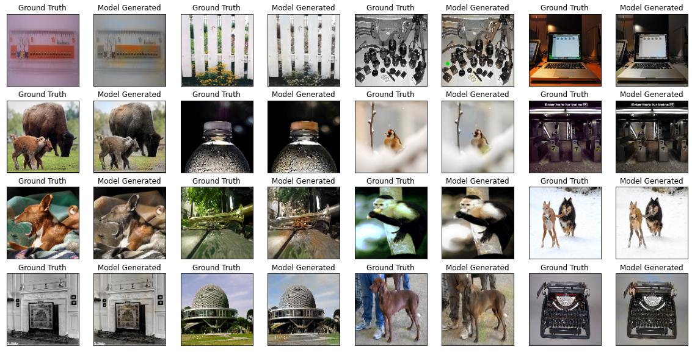
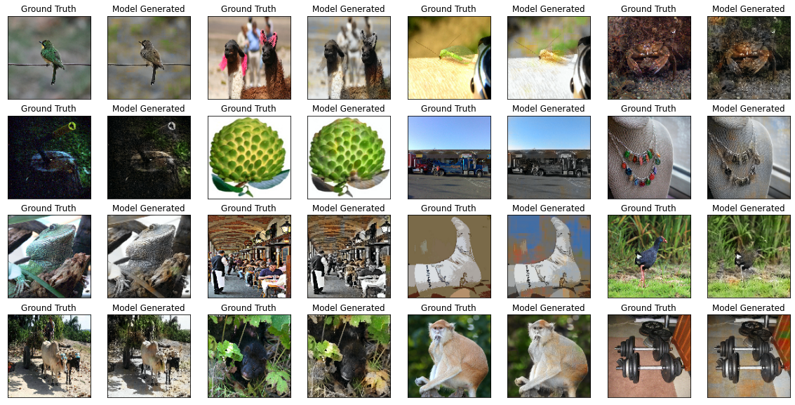
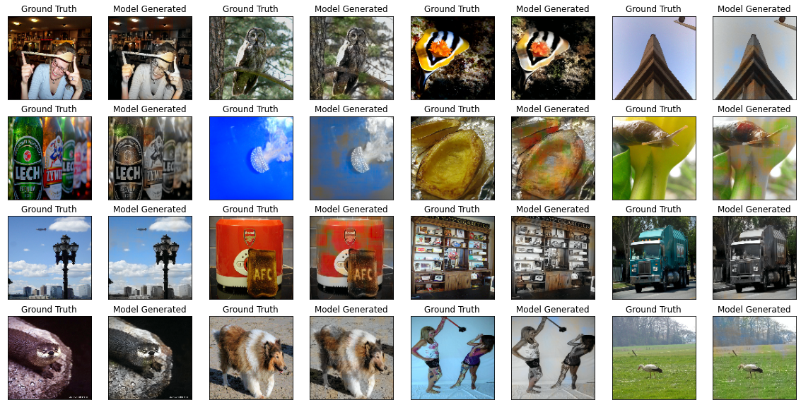
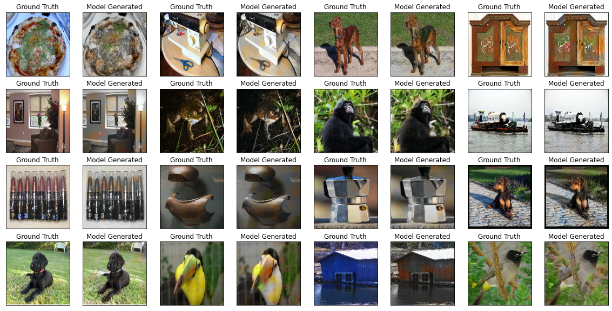

# Image Colorization with GAN

A web application for automatic and user guided image colorization.

We use a Generative Adversarial Network (bases on this [paper](https://arxiv.org/abs/1705.02999)) for the colorization.

## Current Status
* Training the Network on TACC Maverick2.

Here are some of our current results:

The ground truth represents the original image and the other is what our current model produced.

## TODO
* Add user guided colorization in the model
* Deploy the model
* Add user interaction interface
